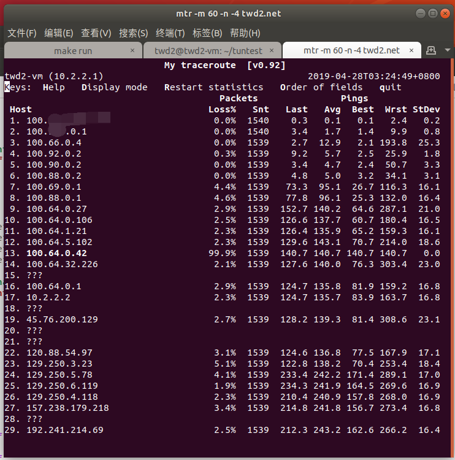

# tun464

This is a lightweight tunnel (or so-called translator) to transit IPv4 packets over an IPv6 network or the IPv6 internet.

Not like ipip6 or other tunnels, it minimizes the MTU overhead by embedding IPv4 addresses into IPv6 addresses. It can reach 1472 (1500 - 40 - 8 + 20) of MTU, while ipip6 would usually decrease MTU to 1452 (1500 - 40 - 8).

A /96 IPv6 prefix is needed for each site since an IPv4 address will be embedded into the low 32 bits of an IPv6 address. For example, consider `192.0.2.1` and `192.0.2.2` are communicating through this tunnel, and the configured prefixes are `2001:db8:1:4646::/96` and `2001:db8:2:4646::/96`. For the IPv6 network, it looks like that `2001:db8:1:4646::c000:201` and `2001:db8:1:4646::c000:202` are communicating with each other.

## Prerequisites

* Build essentials: GCC, make, ...

## Usage

On one site:

```bash
make run
make setup
```

On the other site:

```bash
make run2
make setup2
```

## Demo



In the above figure, the hops reported to be in `100.64.0.0/10` are actually IPv6 routers, and their "IPv4 addresses" are not real.

## References

* [RFC 6144 Framework for IPv4/IPv6 Translation](https://tools.ietf.org/html/rfc6144)
* [RFC 6052 IPv6 Addressing of IPv4/IPv6 Translators](https://tools.ietf.org/html/rfc6052)
* [RFC 6877 464XLAT: Combination of Stateful and Stateless Translation](https://tools.ietf.org/html/rfc6877)
* [RFC 7915 IP/ICMP Translation Algorithm](https://tools.ietf.org/html/rfc7915)
* [RFC 6791 Stateless Source Address Mapping for ICMPv6 Packets](https://tools.ietf.org/html/rfc6791)
